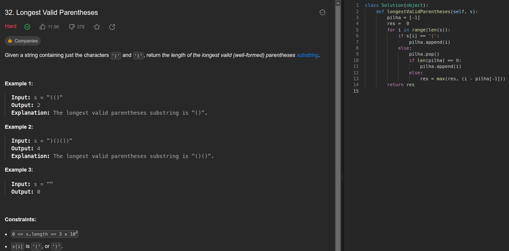
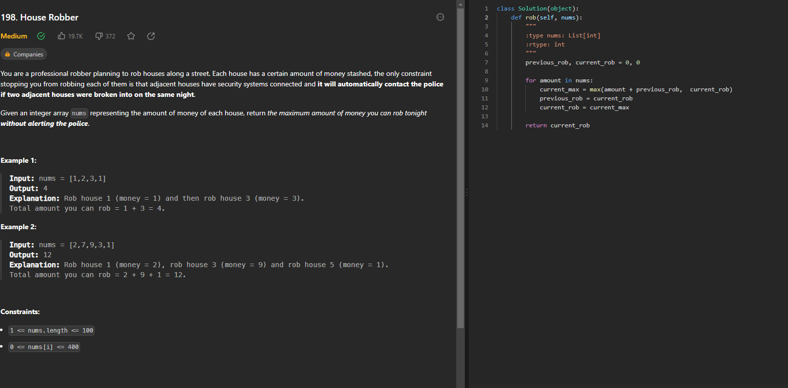

# PD_ExerciciosJuizEletronico

**Número da Lista**: 5 
**Conteúdo da Disciplina**: Programação Dinâmica 

## Alunos
|Matrícula | Aluno |
| -- | -- |
| 20/0049020  |  Gabriel Barbosa Alencar |
| 21/1031708  |  Geovane Freitas |

## Sobre 
Este repositório contém a resolução de exercícios do site [LeetCode](https://leetcode.com/) relacionados a Programação Dinâmica, contemplando alguns dos principais algoritmos deste conteúdo.

## [Link da Apresentação]()

## Screenshots

## Exercicio 1 - Longest Valid Parentheses

Dificuldade: Difícil 
Link: [Longest Valid Parentheses](https://leetcode.com/problems/longest-valid-parentheses/description/)

## Exercicio 2 - 

Dificuldade: Difícil 
Link: [Trapping Rain Water](https://leetcode.com/problems/trapping-rain-water/)

No problema acima, a programação dinâmica se dá na quebra do problema em subproblemas (alturas maximas esquerda e direita) e armazenamento dessas soluções, evitando repetição de calculos.

## Instalação 

**Linguagem**: Python 

Caso queira testar localmente é necessário ter o python instalado

## Uso 

Para verificar o funcionamento basta abrir o link do exercicio e copiar o código referente a questão, e logo após realizar o envio. Caso queira verificar localmente, é necessário adicionar a chamada da função principal com seus devidos paramêtros. Para rodar basta utilizar o comando:

`python3 NomeDoArquivo.py`

